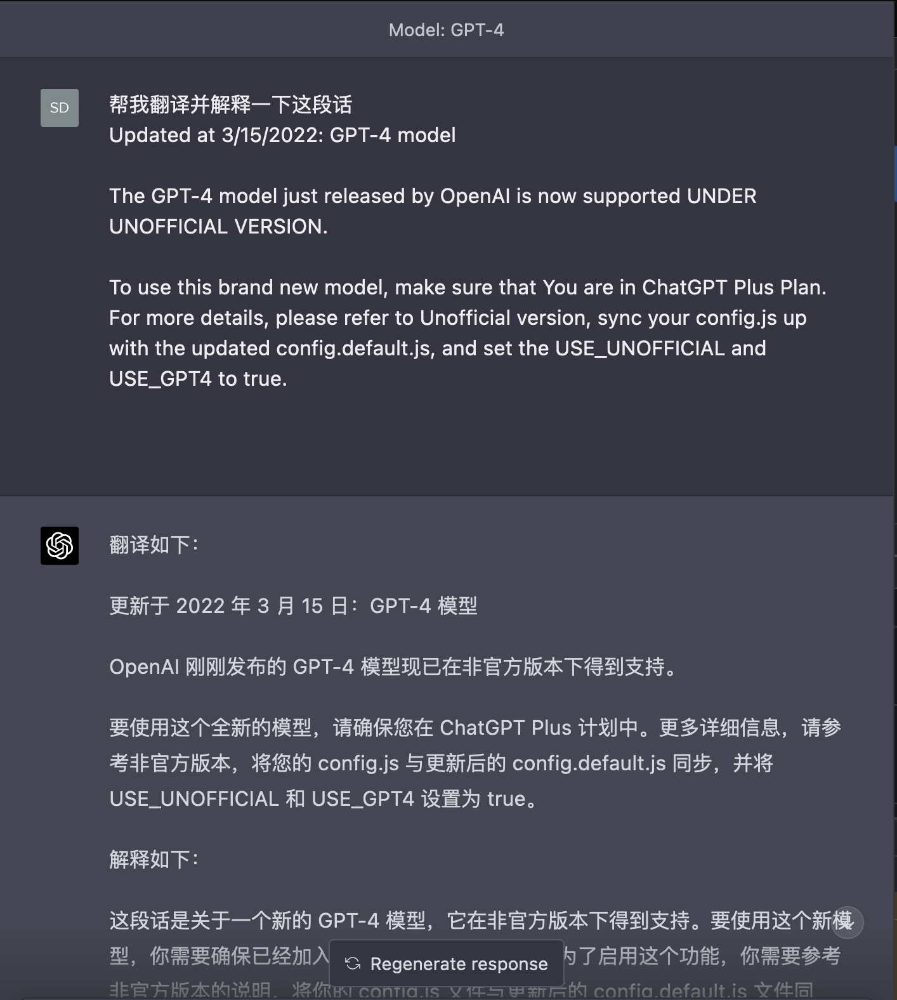

# 使用 openAI API 的 Yunzai-Bot(v3)的 chatGPT 插件

> 使用 openAI 官方 API 或反向代理非官方 API 的
> [Yunzai-Bot](https://gitee.com/yoimiya-kokomi/Yunzai-Bot)(v3)的 chatGPT 插件. 也可以与[GoogleBard](bard.google.com)交谈.

- [使用 openAI API 的 Yunzai-Bot(v3)的 chatGPT 插件](#使用-openai-api-的-yunzai-botv3的-chatgpt-插件)
  - [更新](#更新)
    - [Updated at 10/4/2023: 添加了谷歌的 Google Bard](#updated-at-1042023-添加了谷歌的-google-bard)
  - [用法](#用法)
    - [用法 - 官方 ChatGPT](#用法---官方-chatgpt)
    - [用法 - 非官方 ChatGPT](#用法---非官方-chatgpt)
    - [用法 - 谷歌 Google Bard](#用法---谷歌-google-bard)
  - [配置](#配置)
  - [帮助](#帮助)

## 更新

### Updated at 10/4/2023: 添加了谷歌的 Google Bard

现在你可以在 QQ 中借助 Yunzai-Bot 框架和本插件自由的和 Google Bard 进行交谈了!

更新于 2023 年 3 月 15 日：GPT-4 模型

OpenAI 刚刚发布的 GPT-4 模型现已在此插件的 Unofficial 版本下得到支持。

要使用这个全新的模型，请确保您在 ChatGPT Plus 计划中。更多详细信息，请参考[非官方版本](#用法---非官方-chatgpt)，将您的 config.js 与更新后的 config.default.js 同步，并将 `USE_UNOFFICIAL` 和 `USE_GPT4` 设置为 true。




## 用法

要将此插件用于 [Yunzai-Bot](https://gitee.com/yoimiya-kokomi/Yunzai-Bot)，您需要在这两种方法之间进行选择。
这两种方法都可以记住您的聊天记录。

| 方法         | 费用        | 质量                |
| ------------ | ----------- | ------------------- |
| `正式版`     | OpenAI 积分 | 最佳                |
| `非官方版本` | 免费        | 速率限制； 不太健壮 |

1. `官方版`——使用 OpenAI 官方的`gpt-3.5-turbo`（或
   `gpt-3.5-turbo-0301`，你可以在 `config.js` 中指定）模型。 很鲁棒，
   但不是免费的。 2.`非官方版`-使用非官方的反向代理服务器访问
   聊天 GPT。 它有速率限制，并且 **将您的访问令牌暴露给第三方
   服务器**，而且不那么健壮。 但是**它是免费的**。

**注意**：我建议你使用官方版本，因为它有 OpenAI 的
服务质量的保证。 如果您在使用本插件时遇到问题，
请[打开一个问题](https://github.com/Micuks/chatGPT-yunzai/issues)。

**关于代理**：如果要设置代理等，参考(#配置)
部分。

### 用法 - 官方 ChatGPT

0.注册一个[OpenAI API Key](https://platform.openai.com/overview)，这是
以后需要。

1. 将此存储库克隆到 Yunzai-Bot 文件夹中的 `plugins/` 文件夹中。

```bash
cd Yunzai-Bot
cd plugins
git clone https://github.com/Micuks/chatGPT-yunzai.git
```

2. 复制 `config.default.js` 并在 config 文件夹中将其重命名为 `config.js`。

```bash
cd config
cp config.default.js config.js
```

3. 将您的 OpenAI API 密钥填写到 `config.js` 中的 `API_KEY` 部分，可以通过您的 OpenAI 帐户在 [查看您的 API 密钥](https://platform.openai.com/account/api-keys).

4.更新依赖使用 pnpm 或 npm。

```bash
# 在chatGPT-yunzai文件夹下
pnpm update
# 或者 npm update 如果你改用 npm。
# 或者 npm 安装 chatgpt bull
```

5.运行 Yunzai-Bot，提问！

```bash
# 在Yunzai-Bot根目录下
npm run start
```

```
#在QQ
?告诉我一些关于 Python 的事情
```


### 用法 - 非官方 ChatGPT

1. 将此存储库克隆到 Yunzai-Bot 文件夹中的 `plugins/` 文件夹中。

```bash
cd Yunzai-Bot
cd plugins
git clone https://github.com/Micuks/chatGPT-yunzai.git
```

2. 不同于官方的 ChatGPT，这个版本需要一个 OpenAI access token
   而不是 OpenAI API 密钥。 为此，我为您提供了一个 python 脚本
   `get_access_token.py`。 确保你已经安装了 **python3**。 然后安装
   获取访问令牌的要求。

```bash
pip install -r requirements.txt
pnpm update
pnpm install chatgpt bull
```

3. 复制 `config.default.js` 并在 config 文件夹中将其重命名为 `config.js`。

```bash
cd config
cp config.default.js config.js
```

4.从[这里](https://chat.openai.com/api/auth/session)的JSON对象中直接获取access_token.

然后将访问令牌粘贴到 config.js 中的 API_ACCESS_TOKEN 部分。

6.运行 Yunzai-Bot，提问！

```bash
# 在Yunzai-Bot根目录下
npm run start
```

### 用法 - 谷歌 Google Bard

基本步骤与 ChatGPT 的前面步骤相同。

1. 将该存储库克隆到 Yunzai-Bot 文件夹中的`plugins/`文件夹中。

```bash
cd Yunzai-Bot
cd plugins
git clone https://github.com/Micuks/chatGPT-yunzai.git
```

2. 安装 pnpm 依赖关系

```bash
pnpm install -P
```

3. 在 config 文件夹中复制 `config.default.js` 并将其重命名为 `config.js`。

```bash
cd config
cp config.default.js config.js
```

4. 在 [Google Bard](bard.google.com) 获取 `__Secure-1PSID` cookie，并填写在
   `config.json` 中。


这里是`config.json`中与Bard相关部分的设置.

```javascript
{
   // Google Bard 设置
   const USE_BARD = true; // Google Bard 的总开关
   const BARD_COOKIE =
     "__Secure-1PSID=<**填写你的 __Secure-1PSID cookie 部分**>";
   // 你的 bard cookie。记得 **不要删除** `__Secure-1PSID=` 前缀,
   // 且**不要在等号附近添加空格**.
}
```

5. 运行 Yunzai-Bot，向 Google Bard 提问！

```bash
npm run start
```

## 配置

这里描述了 `config.js` 中的部分。

| 键                    | 描述                                                                  |
| --------------------- | --------------------------------------------------------------------- |
| USE_UNOFFICIAL        | 设置为 `true` 使用非官方版本，设置为 `false` 使用反向代理版本 ChatGPT |
| PROXY                 | 填写您的代理 URL。例如，`http://127.0.0.1:7890`                       |
| MODEL_NAME            | 您要使用的模型。默认情况下不需要修改                                  |
| API_KEY               | OpenAI API 密钥。官方版本需要                                         |
| API_REVERSE_PROXY_URL | 非官方 ChatGPT 反向代理服务器。如果您不知道这是什么，请保留为空。     |
| API_ACCESS_TOKEN      | 如果使用非官方版本，则必须                                            |
| MODEL_PAID            | 如果使用非官方版本并订阅 ChatGPT Plus，请设置为 `true`                |
| USE_GPT4              | 设置为 `true` 使用非官方版本的 GPT-4                                  |
| USE_BARD              | 设置为 `true` 使用 Google Bard                                        |
| BARD_COOKIE           | 谷歌 Google Bard Cookie. 是使用 Bard 所必需的                         |

## 帮助

此插件具有以下功能：

| 功能                      | 指令      | 权限   |
| ------------------------- | --------- | ------ |
| 寻求 ChatGPT 帮助         | #聊天帮助 | 所有人 |
| 询问问题                  | ?问题     | 所有人 |
| 连续对话                  | !问题     | 所有人 |
| 与 GPT-4 聊天             | 4 问题    | 所有人 |
| 与 Google Bard 聊天       | B 问题    | 所有人 |
| 结束当前对话              | #结束对话 | 所有人 |
| 获取聊天统计信息 [管理员] | #聊天列表 | 主人   |
