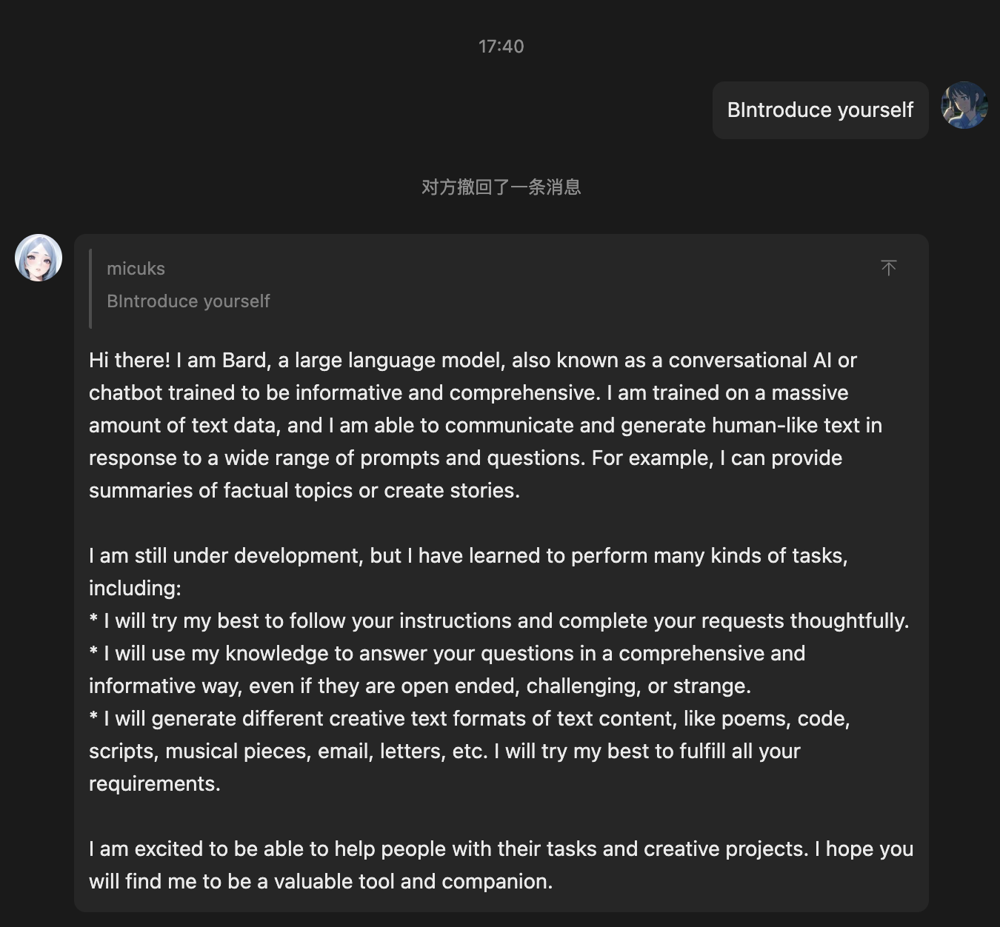
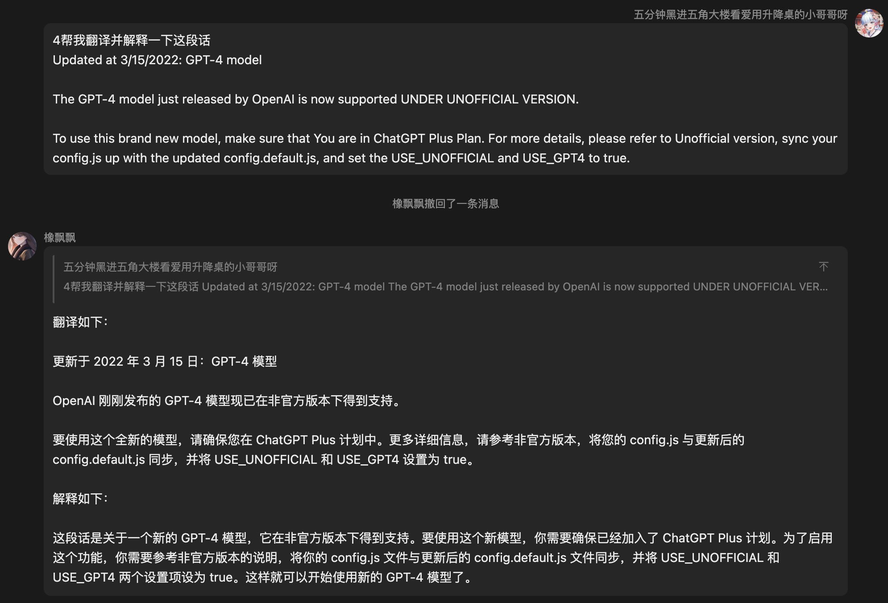
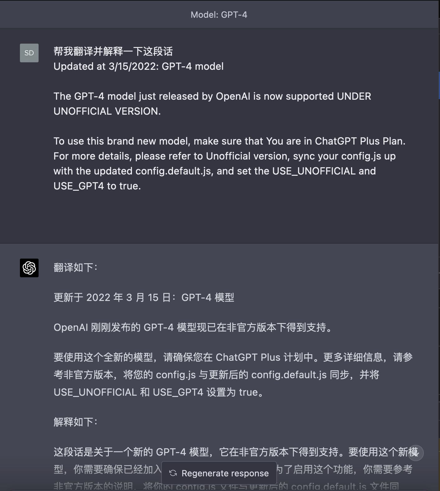
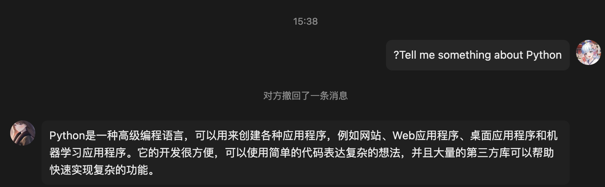

# 使用 openAI API 的 Yunzai-Bot(v3)的 chatGPT 插件

> ChatGPT plugin for [Yunzai-Bot](https://gitee.com/yoimiya-kokomi/Yunzai-Bot)
> with official OpenAI API or unofficial OpenAI API with reverse proxy. With
> additional support to chat with [GoogleBard](bard.google.com).
> 使用 openAI 官方 API 或反向代理非官方 API 的
> [Yunzai-Bot](https://gitee.com/yoimiya-kokomi/Yunzai-Bot)(v3)的 chatGPT 插件. 也可以与[GoogleBard](bard.google.com)交谈.

中文简介在[这里](./readme-zh.md)

- [使用 openAI API 的 Yunzai-Bot(v3)的 chatGPT 插件](#使用-openai-api-的-yunzai-botv3的-chatgpt-插件)
  - [Update](#update)
    - [Updated on 10/4/2023: Google Bard](#updated-on-1042023-google-bard)
    - [Updated on 3/15/2023: GPT-4 model](#updated-on-3152023-gpt-4-model)
  - [Usage](#usage)
    - [Usage - Official ChatGPT](#usage---official-chatgpt)
    - [Usage - Unofficial ChatGPT](#usage---unofficial-chatgpt)
    - [Usage - Google Bard](#usage---google-bard)
  - [Config](#config)
  - [Help](#help)

## Update

### Updated on 10/4/2023: Google Bard

Now you can chat with [**Google Bard**](bard.google.com) in QQ via Yunzai-Bot freely!



To chat with GoogleBard, first you should sync your npm dependencies via `pnpm
update -P`. Then sync your `config.js` up with the latest `config.default.js`,
set the `USE_BARD` to true and fill in `BARD_COOKIE` with your bard cookie. You
can find the [detailed usage](#usage---google-bard).

If you encounter network issues, try using a proxy located in **the United States**!

### Updated on 3/15/2023: GPT-4 model

The GPT-4 model just released by OpenAI is now supported **UNDER UNOFFICIAL VERSION**.

To use this brand new model, make sure that **You are in ChatGPT Plus Plan**. For more details, please refer to [Unofficial version](#usage--unofficial-chatgpt), sync your `config.js` up with the updated `config.default.js`, and set the `USE_UNOFFICIAL` and `USE_GPT4` to true.



The actual request and response can be seen at ChatGPT website directly due to we are using Unofficial version.



## Usage

To use this plugin for [Yunzai-Bot](https://gitee.com/yoimiya-kokomi/Yunzai-Bot), you need to pick between these two methods.
Both methods can memory your chat history.

| Method               | Cost           | Quality                   |
| -------------------- | -------------- | ------------------------- |
| `Official version`   | OpenAI Credits | Best                      |
| `Unofficial version` | Free           | Rate limit; Not so robust |

1. `Official version` - Uses the OpenAI official `gpt-3.5-turbo` ( or
   `gpt-3.5-turbo-0301`, you can specify in `config.js` ) model. It's rubust,
   but not free.
2. `Unofficial version` - Uses an unofficial reverse proxy server to access
   ChatGPT. It has a rate limit, and **exposes your access token to a third
   party**, and not so robust. But **it's free**.

**Note**: I recommend you to use official version for it has OpenAI's
guarantee for service quality. If you have problems when using this plugin,
please [Open an issue](https://github.com/Micuks/chatGPT-yunzai/issues).

**About proxy**: If you want to set proxy and other things, refer to (#Config)
section.

### Usage - Official ChatGPT

0. Sign up for an [OpenAI API Key](https://platform.openai.com/overview), this is
   needed later.

1. Clone this reposity into `plugins/` folder in your Yunzai-Bot folder.

```bash
cd Yunzai-Bot
cd plugins
git clone https://github.com/Micuks/chatGPT-yunzai.git
```

2. Copy `config.default.js` and rename it as `config.js` in config folder.

```bash
cd config
cp config.default.js config.js
```

3. Fill your OpenAI API Key into `API_KEY` section in `config.js` , which can be obtained with your OpenAI account at [view your API keys](https://platform.openai.com/account/api-keys).

4. Update dependences use pnpm or npm.

```bash
# In chatGPT-yunzai folder
pnpm update
# or npm update if you use npm instead.
# or npm install chatgpt bull
```

5. Run Yunzai-Bot, ask questions!

```bash
# In Yunzai-Bot root folder
npm run start
```

```
# in QQ
?Tell me something about Python
```



### Usage - Unofficial ChatGPT

1. Clone this reposity into `plugins/` folder in your Yunzai-Bot folder.

```bash
cd Yunzai-Bot
cd plugins
git clone https://github.com/Micuks/chatGPT-yunzai.git
```

2. Different from official ChatGPT, this version requires an OpenAI access token
   instead of an OpenAI API Key. To get this, simply access 
   "https://chat.openai.com/api/auth/session" and get your access_token from
   the JSON object.

   Then paste the access_token to `API_ACCESS_TOKEN` section in `config.js`.

3. Copy `config.default.js` and rename it as `config.js` in config folder.

```bash
cd config
cp config.default.js config.js
```

4. run the
   following commands to get access token. Or get access token from [here](https://chat.openai.com/api/auth/session) directly.

```bash
python3 get_access_token.py
# Fill in your OpenAI email and password, then copy the access token you were
given.
```

Then paste the access token to `API_ACCESS_TOKEN` section in `config.js`.

6. Run Yunzai-Bot, ask questions!

```bash
# In Yunzai-Bot root folder
npm run start
```

### Usage - Google Bard

The basic steps are the same as the previous steps for ChatGPT.

1. Clone this reposity into `plugins/` folder in your Yunzai-Bot folder.

```bash
cd Yunzai-Bot
cd plugins
git clone https://github.com/Micuks/chatGPT-yunzai.git
```

2. Install pnpm dependencies

```bash
pnpm install -P
```

3. Copy `config.default.js` and rename it as `config.js` in config folder.

```bash
cd config
cp config.default.js config.js
```

4. Get `__Secure-1PSID` cookie at [Google Bard](bard.google.com), and fill it in
   `config.json`.

Here's the related config for GoogleBard in `config.json`.

```javascript
{
   // Google Bard settings
   const USE_BARD = true; // The master switch for Google Bard
   const BARD_COOKIE =
     "__Secure-1PSID=<**Fill in your __Secure-1PSID cookie section**>";
   // Your bard cookie. Remember **not to delete** the `__Secure-1PSID=` prefix
}
```

5. Run Yunzai-Bot, ask questions to Google Bard!

```bash
npm run start
```

## Config

The sections in `config.js` are described here.

| Key                   | Description                                                                             |
| --------------------- | --------------------------------------------------------------------------------------- |
| USE_UNOFFICIAL        | `true` to use unofficial version, `false` to use official version                       |
| PROXY                 | Fill in your proxy url. For example, `http://127.0.0.1:7890`                            |
| MODEL_NAME            | The model you want to use. Need not to modify by default                                |
| API_KEY               | OpenAI API Key. Needed for Official version                                             |
| API_REVERSE_PROXY_URL | Unofficial ChatGPT reverse proxy server. If you don't know what this is, keep it blank. |
| API_ACCESS_TOKEN      | This is necessary if you use unofficial version                                         |
| MODEL_PAID            | If you use **unofficial** and subscribed **ChatGPT Plus**, set this to `true`           |
| USE_GPT4              | `true` to use **GPT-4** in **unofficial version**                                       |
| USE_BARD              | set to `true` to use **Google Bard**                                                    |

## Help

This plugin has following features:

| Feature                             | Command      | Permission |
| ----------------------------------- | ------------ | ---------- |
| Seek ChatGPT help                   | #chatgpthelp | Everyone   |
| Ask a question                      | ?Question    | Everyone   |
| Continuous Chatting                 | !Question    | Everyone   |
| Chat with GPT-4                     | 4Question    | Everyone   |
| Chat with Google Bard               | BQuestion    | Everyone   |
| End current chat                    | #结束对话    | Everyone   |
| Get chat statistics [Administrator] | #聊天列表    | Master     |
